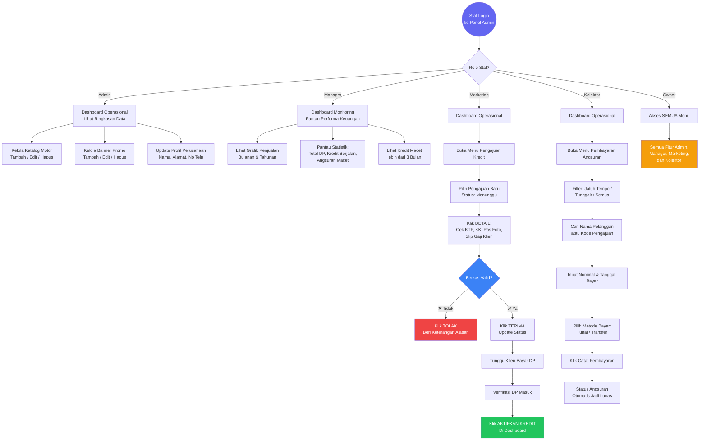

# 📘 Dokumentasi Lengkap Sistem Angga Credit Motors
**Versi:** 1.0 — Production Ready  
**Database:** MySQL (`kreditmotorangga`)  
**Dibuat:** 2 Mei 2026  

---

## 📑 Daftar Isi
1. Gambaran Umum Sistem
2. Daftar Seluruh Halaman (Sitemap)
3. Flowchart Alur Klien (Pengajuan & Pembayaran)
4. Flowchart Alur Internal Tim
5. Pembagian Tugas & Hak Akses Per Role
6. Panduan Deployment ke Server

---

## 1. 🏢 Gambaran Umum Sistem

**Angga Credit Motors** adalah platform kredit motor berbasis web yang menghubungkan **calon pembeli motor** dengan **tim operasional dealer**. Sistem ini menangani seluruh alur bisnis dari awal hingga akhir:

- Calon pembeli memilih motor dan mengajukan kredit secara online.
- Tim marketing memverifikasi dokumen identitas dan kelayakan kredit.
- Pembayaran DP dan cicilan bulanan dilakukan via **Midtrans** (online) atau **manual ke kolektor**.
- Seluruh data dipantau secara real-time oleh Manager dan Owner.

**Teknologi yang Digunakan:**
| Komponen | Teknologi |
|---|---|
| Backend | Laravel 11 (PHP) |
| Frontend | Blade Template + Tailwind CSS |
| Database | MySQL |
| Pembayaran | Midtrans Snap.js |
| Email OTP | SMTP Gmail |
| Storage | Local Disk (Upload Dokumen) |

---

## 2. 🗺️ Daftar Seluruh Halaman (Sitemap)

### 🌐 Area Publik (Dapat Diakses Siapa Saja)
| Halaman | URL | Fungsi |
|---|---|---|
| **Beranda / Landing Page** | `/` | Etalase motor, banner promo, info perusahaan |
| **Form Pengajuan Kredit** | `/motor/{id}/ajukan` | Mengisi data diri & upload dokumen KTP/KK/Foto/Slip Gaji |

### 🔐 Area Autentikasi
| Halaman | URL | Fungsi |
|---|---|---|
| **Login** | `/login` | Masuk ke akun |
| **Daftar (Step 1: Email)** | `/register` | Input email untuk dikirim OTP |
| **Verifikasi OTP** | `/register/verify-otp` | Input kode 6 digit yang dikirim via email |
| **Lengkapi Data (Step 2)** | `/register/complete` | Isi nama, nomor HP, dan password |
| **Lupa Password** | `/forgot-password` | Request OTP reset password via email |
| **Reset Password** | `/reset-password/otp` | Input OTP dan buat password baru |

### 👤 Area Klien (Harus Login sebagai Pelanggan)
| Halaman | URL | Fungsi |
|---|---|---|
| **Status Pengajuan Saya** | `/pengajuan-saya` | Lihat daftar & status semua pengajuan kredit yang pernah dibuat |
| **Bayar DP** | `/pengajuan-saya/{id}/bayar` | Halaman bayar uang muka via Midtrans |
| **Sukses Bayar DP** | `/pengajuan-saya/{id}/sukses` | Konfirmasi dan detail setelah DP berhasil dibayar |
| **Tagihan & Cicilan** | `/tagihan-saya` | Lihat semua tagihan cicilan bulanan yang aktif |
| **Bayar Cicilan** | `/tagihan-saya/{id}/bayar` | Bayar satu tagihan angsuran via Midtrans |

### 🖥️ Area Panel Admin (Harus Login sebagai Staf Internal)
| Halaman | URL | Akses Role |
|---|---|---|
| **Dashboard Operasional** | `/dashboard` | Semua staf internal |
| **Dashboard Monitoring** | `/monitoring` | Manager & Owner |
| **Daftar Pengajuan Kredit** | `/pengajuan` | Marketing, Surveyor, Kolektor, Owner |
| **Detail Pengajuan** | `/pengajuan/{id}` | Marketing, Surveyor, Kolektor, Owner |
| **Input Pembayaran Manual** | `/pembayaran` | Marketing, Kolektor, Owner |
| **Manajemen Kredit Aktif** | `/kredit` | Marketing & Owner |
| **Detail Kredit** | `/kredit/{id}` | Marketing & Owner |
| **Katalog Motor** | `/motor` | Admin & Owner |
| **Tambah Motor** | `/motor/create` | Admin & Owner |
| **Edit Motor** | `/motor/{id}/edit` | Admin & Owner |
| **Banner Landing** | `/banner` | Admin & Owner |
| **Tambah Banner** | `/banner/create` | Admin & Owner |
| **Edit Banner** | `/banner/{id}/edit` | Admin & Owner |
| **Profil Perusahaan** | `/perusahaan` | Admin & Owner |
| **Profil Akun** | `/profile` | Semua pengguna yang login |

---

## 3. 🔄 Flowchart Alur Klien (End-to-End)
Dari pertama buka website hingga kredit lunas.

```mermaid
flowchart TD
    A((🌐 Buka Website\nAngga Motors)) --> B[🏍️ Lihat Katalog Motor\ndi Landing Page]
    B --> C[Pilih Motor &\nKlik Ajukan Kredit]
    C --> D{Sudah Punya Akun?}

    D -- Belum --> E[Daftar Akun Baru]
    E --> E1[Masukkan Email\nKlik Kirim OTP]
    E1 --> E2[Cek Email &\nInput Kode OTP 6 Digit]
    E2 --> E3[Isi Nama, No HP\n& Buat Password]
    E3 --> F

    D -- Sudah --> F[Login dengan\nEmail & Password]

    F --> G[Isi Form Pengajuan Kredit]
    G --> G1[Data Diri:\nNama, Alamat, Pekerjaan,\nPenghasilan/Bulan]
    G1 --> G2[Upload Dokumen:\nKTP, KK, Pas Foto,\nSlip Gaji]
    G2 --> G3[Pilih Motor &\nTenor Cicilan]
    G3 --> H[Submit Pengajuan]

    H --> I[Status: ⏳ Menunggu Konfirmasi]
    I --> J{Marketing Cek\nKelayakan & Berkas}

    J -- ❌ Tidak Layak --> K[Status: Dibatalkan\nPelanggan Diberi Notifikasi]
    J -- ✅ Layak --> L[Status: Diterima\nDP Harus Dibayar]

    L --> M[Klien Klik Bayar DP\ndi Halaman Pengajuan Saya]
    M --> N[Pilih Metode Bayar:\nTransfer / VA / QRIS]
    N --> O[Bayar via Midtrans]
    O --> P[Status: ⏳ Menunggu Aktivasi Kredit]

    P --> Q[Marketing Verifikasi\n& Aktifkan Kontrak]
    Q --> R[Status: Kredit Aktif 🚀]

    R --> S[Tagihan Bulanan\nMuncul di Akun Klien]
    S --> T{Cara Bayar Cicilan?}

    T -- 📱 Online --> U[Bayar via Midtrans\nTransfer / VA / QRIS]
    T -- 🤝 Tunai --> V[Bayar ke Kolektor\ndi Lapangan / Kantor]

    U --> W[Sistem Otomatis\nUpdate Status Lunas]
    V --> X[Kolektor Input\nManual ke Sistem]

    W --> Y{Ini Cicilan Terakhir?}
    X --> Y

    Y -- Belum --> S
    Y -- ✅ Sudah --> Z((🏁 KREDIT LUNAS\nTerima Kasih!))

    style A fill:#6366f1,color:#fff,stroke:#4f46e5
    style Z fill:#22c55e,color:#fff,stroke:#16a34a
    style J fill:#3b82f6,color:#fff,stroke:#2563eb
    style Q fill:#f59e0b,color:#fff,stroke:#d97706
    style K fill:#ef4444,color:#fff,stroke:#dc2626
    style R fill:#10b981,color:#fff,stroke:#059669
```



---

## 4. 🏢 Flowchart Alur Internal Tim
Cara kerja staf dealer dari dalam panel admin.



---

## 5. 👥 Pembagian Tugas & Hak Akses Per Role

### 🔵 Admin — Pengelola Konten & Identitas Dealer
Bertanggung jawab atas "wajah" dan "identitas" bisnis di website.

**Yang bisa dilakukan:**
- ✅ Tambah motor baru ke katalog (nama, harga, foto, spesifikasi).
- ✅ Edit harga atau stok motor yang sudah ada.
- ✅ Hapus motor yang sudah tidak dijual.
- ✅ Tambah/ubah/hapus banner promo di halaman depan website.
- ✅ Ganti nama perusahaan, alamat kantor, nomor telepon, dan logo.

**Yang TIDAK bisa dilakukan:**
- ❌ Melihat data pengajuan kredit klien.
- ❌ Memproses pembayaran cicilan.
- ❌ Melihat grafik pendapatan dan laporan keuangan.

---

### 🟡 Manager — Analis Performa & Monitoring Pendapatan
Bertanggung jawab memastikan bisnis berjalan menguntungkan dengan memantau data keuangan.

**Yang bisa dilakukan:**
- ✅ Melihat grafik penjualan motor per bulan/tahun.
- ✅ Memantau total DP yang masuk dalam periode tertentu.
- ✅ Melihat daftar kredit macet (tunggak lebih dari 3 bulan).
- ✅ Melihat statistik jumlah kredit berjalan vs kredit lunas.

**Yang TIDAK bisa dilakukan:**
- ❌ Input atau ubah data transaksi.
- ❌ Menyetujui atau menolak pengajuan kredit.
- ❌ Mengubah katalog motor atau banner.

---

### 🟢 Marketing — Verifikator & Activator Kredit
Ujung tombak operasional, yang memutuskan apakah klien layak mendapat kredit.

**Yang bisa dilakukan:**
- ✅ Melihat daftar semua pengajuan kredit masuk.
- ✅ Membuka detail pengajuan: melihat foto KTP, KK, Pas Foto, Slip Gaji klien.
- ✅ Menyetujui (TERIMA) atau menolak (TOLAK) pengajuan.
- ✅ Mengaktifkan kontrak kredit setelah DP dibayar klien.
- ✅ Melihat daftar kredit aktif.

---

### 🔴 Kolektor — Penagih & Pencatat Pembayaran
Staf lapangan yang bertemu langsung dengan nasabah untuk menagih cicilan.

**Yang bisa dilakukan:**
- ✅ Melihat daftar angsuran yang jatuh tempo hari ini.
- ✅ Melihat daftar angsuran yang sedang tunggak.
- ✅ Mencatat pembayaran cicilan yang diterima secara tunai.
- ✅ Memilih metode bayar (tunai, transfer, dll) saat mencatat.

---

### 👑 Owner — Kontrol Penuh Tanpa Batas
Pemilik bisnis yang bisa mengakses dan melakukan semua fungsi di atas.

---

## 6. 🛠️ Panduan Deployment ke Server Ubuntu

Setelah pengembangan selesai di lokal (XAMPP), ikuti langkah ini untuk naik ke server:

### Langkah 1: Upload Kode
Upload semua file project ke server, kecuali folder `node_modules` dan `vendor`.

### Langkah 2: Install Dependency
```bash
composer install --optimize-autoloader --no-dev
npm install && npm run build
```

### Langkah 3: Konfigurasi Environment
```bash
# Salin file env dan isi sesuai server
cp .env.example .env
php artisan key:generate
```
Pastikan isi `.env` sudah benar:
```
APP_ENV=production
APP_DEBUG=false
APP_URL=https://nama-domain-anda.com
DB_CONNECTION=mysql
DB_DATABASE=kreditmotorangga
```

### Langkah 4: Migrasi Database
```bash
php artisan migrate --force
```

### Langkah 5: Set Izin File
```bash
sudo chown -R www-data:www-data storage bootstrap/cache
sudo chmod -R 775 storage bootstrap/cache
php artisan storage:link
```

### Langkah 6: Optimasi Performa
```bash
php artisan config:cache
php artisan route:cache
php artisan view:cache
```

---

## 7. 🗄️ Ringkasan Tabel Database

| Tabel | Fungsi |
|---|---|
| `users` | Data semua pengguna (staf & pelanggan) beserta role-nya |
| `roles` | Daftar role: Owner, Manager, Admin, Marketing, Kolektor |
| `pelanggans` | Data profil lengkap pelanggan (NIK, alamat, pekerjaan, dll) |
| `motors` | Katalog motor (nama, harga, foto, spesifikasi) |
| `jenis_cicilans` | Pilihan tenor dan persentase bunga cicilan |
| `asuransis` | Pilihan paket asuransi kredit |
| `pengajuan_kredits` | Inti sistem: semua data pengajuan & dokumen yang diupload |
| `kredits` | Kontrak kredit aktif setelah pengajuan disetujui & DP dibayar |
| `angsurans` | Rincian tagihan cicilan bulanan per kontrak kredit |
| `banners` | Gambar banner promo di halaman landing page |
| `settings` | Konfigurasi nama perusahaan, alamat, nomor telp, logo |
| `sessions` | Data sesi login pengguna yang aktif |

---

*Dokumen ini mencakup seluruh aspek sistem Angga Credit Motors.*
*Harap diperbarui setiap kali ada perubahan fitur besar.*
